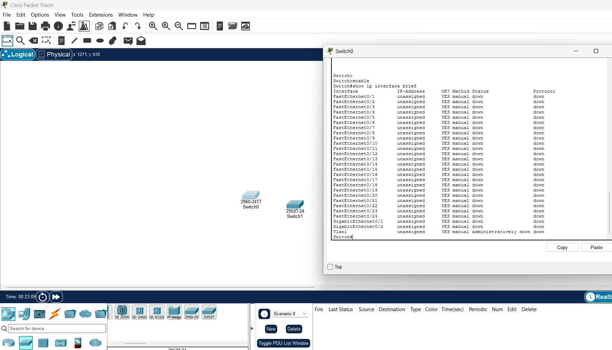

**ANHANGUERA**

Curso Superior de Tecnologia em Análise e Desenvolvimento de Sistemas

Disciplina: Redes de Computadores

**PROJETO DA REDE DA EMPRESA SUPER TECH NO CISCO PACKET TRACER**

Aluno: Hadrian Rafael Silva de Oliveira

RA: 3502923907

Situação: Formando

Unidade: Suzano/SP – I(12563675)AC

Semestre: 2º semestre de 2026

Mediador Pedagógico Online: Rogian Villa

Suzano/SP, 2026

---

## Sumário

- 1. Introdução
- 2. Métodos
- 3. Desenvolvimento
- 4. Resultados
- 5. Conclusão
- Referências
- Anexo A – Endereçamento por porta
- Anexo B – Configuração dos switches
- Anexo C – Plano de verificação

---

## 1. Introdução

Uma rede de computadores é um conjunto de dispositivos interligados que trocam dados por meio de meios de transmissão e de protocolos comuns. A forma como esses dispositivos são ligados entre si é a topologia. Neste trabalho cada departamento da empresa foi organizado em **topologia estrela**, em que todos os equipamentos se ligam a um ponto central, aqui um **switch**. Nessa topologia o defeito em um cabo afeta somente o equipamento ligado a ele; em contrapartida, a falha do ponto central interrompe todo o segmento.

O switch opera na camada de enlace: aprende os endereços MAC dos equipamentos ligados a cada porta e encaminha cada quadro apenas à porta de destino, o que reduz colisões e tráfego desnecessário. A comunicação entre redes diferentes, por sua vez, depende de equipamentos da camada de rede, como o roteador.

O endereçamento utiliza o **IPv4**, com 32 bits divididos em parte de rede e parte de host por meio de uma máscara. Em uma rede Classe C a máscara padrão é /24 (255.255.255.0), e esse bloco pode ser dividido em sub-redes menores (**subnetting**) tomando bits emprestados da parte de host. Uma sub-rede com *n* bits de host oferece 2ⁿ − 2 endereços utilizáveis, pois o primeiro endereço identifica a rede e o último é o de broadcast. O bloco 192.168.10.0/24, adotado aqui, pertence à faixa de endereços privados da RFC 1918.

As **VLANs** (redes locais virtuais) dividem logicamente um switch em domínios de broadcast independentes. Em geral, cada VLAN corresponde a uma sub-rede IP própria. Quando há mais de um switch, a ligação entre eles pode ser um **trunk** (IEEE 802.1Q), que transporta o tráfego de várias VLANs por um mesmo enlace.

O **DHCP** distribui endereços IP automaticamente a partir de uma faixa configurada em um servidor, dispensando a configuração manual de cada host. Como o pedido do cliente é um broadcast, ele só chega a servidores que estejam na mesma VLAN, a menos que exista um agente de relay.

O objetivo da atividade é projetar a rede da empresa fictícia Super Tech, com os departamentos de Engenharia, Compras, TI Interno e Infraestrutura, para o ambiente do **Cisco Packet Tracer**, aplicando subnetting, VLANs, interligação de switches e endereçamento estático e dinâmico. O documento apresenta o cálculo das sub-redes, o plano de endereçamento, as configurações dos switches e o plano de verificação.

## 2. Métodos

### 2.1 Ferramenta e equipamentos

A rede foi projetada para o Cisco Packet Tracer. Cada departamento tem 20 estações (PC), 2 servidores e 2 impressoras, ou seja, 24 hosts, e cada um deles possui um switch. Ao todo são 4 switches, 80 PCs, 8 servidores e 8 impressoras (100 equipamentos).

O enunciado cita o switch 2950-24. Como as 24 portas FastEthernet de cada switch são ocupadas pelos hosts, a interligação entre os switches exige portas adicionais. Por isso, antes de fechar o projeto, consultou-se no simulador a lista de interfaces do switch com o comando `show ip interface brief`. O **Cisco 2960-24TT** apresentou 24 portas FastEthernet (Fa0/1 a Fa0/24), duas portas GigabitEthernet (Gi0/1 e Gi0/2) e a interface Vlan1 (Figura 1), e foi adotado nos quatro departamentos. As portas Gigabit são usadas na interligação dos switches. Trata-se de modelo diferente do citado no enunciado, escolhido pela disponibilidade dessas portas.



*Figura 1 – Interfaces do switch 2960-24TT no Cisco Packet Tracer*

### 2.2 Cálculo das sub-redes

Cada departamento tem 24 hosts e cada VLAN, 12. Com 5 bits de host (/27) há 2⁵ − 2 = 30 endereços utilizáveis, suficientes para 24 hosts. Com 4 bits (/28) há 2⁴ − 2 = 14, número que não comporta 24 hosts, mas atende aos 12 de cada VLAN.

O enunciado afirma que "a rede seria de 227, o host de 25". Como 227 não é valor possível para um octeto de máscara (os valores válidos são 0, 128, 192, 224, 240, 248, 252, 254 e 255), o trecho foi interpretado como /27, isto é, 5 bits de host e 2⁵ endereços por sub-rede, que é o menor bloco capaz de comportar 24 hosts. Trata-se de uma interpretação do texto, registrada como tal.

A partir do bloco 192.168.10.0/24 foram reservados quatro blocos /27, um por departamento. Como cada departamento possui duas VLANs e cada VLAN deve ter sua própria sub-rede IP, cada /27 foi dividido em dois /28 (255.255.255.240), um por VLAN. Os hosts são configurados com a máscara /28. O espaço 192.168.10.128/25 permanece livre para expansão.

### 2.3 VLANs e distribuição das portas

Em cada switch, as portas Fa0/1 a Fa0/12 formam a primeira VLAN e as portas Fa0/13 a Fa0/24 formam a segunda, cada uma com 10 estações, 1 impressora e 1 servidor (portas 1 a 10, 11 e 12 na primeira; 13 a 22, 23 e 24 na segunda).

Como os switches serão interligados por trunk, repetir os identificadores 1 e 2 em todos os departamentos faria cada VLAN atravessar todos os switches. Os quatro departamentos passariam a compartilhar o mesmo domínio de broadcast e dois servidores DHCP responderiam ao mesmo pedido. Para evitar isso, as VLANs receberam identificadores exclusivos por departamento, mantendo a divisão 1–12 e 13–24 pedida no roteiro: Engenharia 11 e 12, Compras 21 e 22, TI Interno 31 e 32 e Infraestrutura 41 e 42. O enunciado não esclarece se "VLAN 1" e "VLAN 2" são números literais ou apenas a primeira e a segunda VLAN de cada departamento; adotou-se a segunda leitura.

### 2.4 Interligação dos switches

Os switches são ligados em cadeia (SW-ENG, SW-COMP, SW-TI, SW-INFRA) por três enlaces em trunk 802.1Q nas portas Gigabit (Tabela 3 da seção 3). O enunciado não define o desenho da interligação; a cadeia usa o menor número de enlaces e não forma laços, de modo que o spanning-tree não precisa bloquear nenhuma porta. O banco de VLANs é o mesmo nos quatro switches, com o VTP em modo transparente, e cada VLAN possui portas de acesso em um único switch.

### 2.5 Endereçamento IP

Engenharia e TI Interno usam IP estático em todos os dispositivos. O endereço de cada host segue a posição dele na VLAN: o primeiro host recebe o endereço da rede mais 1, o segundo, mais 2, e assim por diante, até o décimo segundo.

Compras e Infraestrutura usam IP dinâmico. Cada VLAN possui um servidor, e é ele que executa o serviço DHCP, com endereço estático, na própria VLAN; assim não é necessário agente de relay e cada VLAN tem exatamente um servidor DHCP. PCs e impressoras recebem endereços de um pool que começa no endereço da rede mais 1 e tem 11 endereços (10 PCs e 1 impressora), de modo que a numeração dinâmica segue a mesma sequência da numeração estática. O servidor ocupa a posição 12 e fica fora do pool.

### 2.6 Configuração dos switches

Cada switch recebe a mesma estrutura de configuração: nome do equipamento, VTP em modo transparente, criação das oito VLANs do projeto, portas Fa0/1–12 como acesso na primeira VLAN do departamento, portas Fa0/13–24 como acesso na segunda VLAN e portas Gigabit em modo trunk com as oito VLANs permitidas. Como exemplo, o trecho abaixo mostra a configuração do SW-COMP; as quatro configurações completas estão no Anexo B.

```
enable
configure terminal
hostname SW-COMP
vtp mode transparent
vlan 11
 name ENG-VLAN1
vlan 12
 name ENG-VLAN2
vlan 21
 name COMP-VLAN1
vlan 22
 name COMP-VLAN2
vlan 31
 name TI-VLAN1
vlan 32
 name TI-VLAN2
vlan 41
 name INFRA-VLAN1
vlan 42
 name INFRA-VLAN2
exit
interface range FastEthernet0/1 - 12
 switchport mode access
 switchport access vlan 21
 no shutdown
exit
interface range FastEthernet0/13 - 24
 switchport mode access
 switchport access vlan 22
 no shutdown
exit
interface GigabitEthernet0/1
 switchport mode trunk
 switchport trunk allowed vlan 11,12,21,22,31,32,41,42
 no shutdown
exit
interface GigabitEthernet0/2
 switchport mode trunk
 switchport trunk allowed vlan 11,12,21,22,31,32,41,42
 no shutdown
exit
end
write memory
```

### 2.7 Verificação

A verificação prevista tem duas partes. Nos switches, os comandos `show vlan brief`, `show interfaces trunk` e `show cdp neighbors` confirmam as VLANs e as portas, os trunks e os vizinhos. Nos hosts, o comando `ipconfig` confere o endereço de cada dispositivo e o comando `ping` testa a comunicação dentro das VLANs, entre as VLANs de um departamento e entre departamentos. O Anexo C lista os 31 testes planejados, com origem, destino, comando e comportamento esperado.

## 3. Desenvolvimento

### 3.1 Organização da rede

A rede é formada por quatro estrelas, uma por departamento, ligadas em cadeia pelos switches. Em cada departamento, 24 equipamentos se ligam ao switch por cabo direto (copper straight-through), um por porta, nas portas Fa0/1 a Fa0/24. Os switches se ligam entre si por cabo cruzado (copper cross-over) nas portas Gigabit.

**Tabela 1 – Equipamentos por departamento**

| Departamento | Switch | PCs | Impressoras | Servidores | Hosts |
|---|---|---|---|---|---|
| Engenharia | SW-ENG | 20 | 2 | 2 | 24 |
| Compras | SW-COMP | 20 | 2 | 2 | 24 |
| TI Interno | SW-TI | 20 | 2 | 2 | 24 |
| Infraestrutura | SW-INFRA | 20 | 2 | 2 | 24 |
| Total | 4 | 80 | 8 | 8 | 96 |

**Tabela 2 – Distribuição das portas e das VLANs em cada switch**

| Departamento | VLAN | Portas | PCs | Impressora | Servidor |
|---|---|---|---|---|---|
| Engenharia | 11 | Fa0/1–12 | Fa0/1–10 | Fa0/11 | Fa0/12 |
| Engenharia | 12 | Fa0/13–24 | Fa0/13–22 | Fa0/23 | Fa0/24 |
| Compras | 21 | Fa0/1–12 | Fa0/1–10 | Fa0/11 | Fa0/12 |
| Compras | 22 | Fa0/13–24 | Fa0/13–22 | Fa0/23 | Fa0/24 |
| TI Interno | 31 | Fa0/1–12 | Fa0/1–10 | Fa0/11 | Fa0/12 |
| TI Interno | 32 | Fa0/13–24 | Fa0/13–22 | Fa0/23 | Fa0/24 |
| Infraestrutura | 41 | Fa0/1–12 | Fa0/1–10 | Fa0/11 | Fa0/12 |
| Infraestrutura | 42 | Fa0/13–24 | Fa0/13–22 | Fa0/23 | Fa0/24 |

**Tabela 3 – Enlaces entre os switches (trunk 802.1Q, cabo cruzado)**

| Enlace | Switch A / porta | Switch B / porta |
|---|---|---|
| 1 | SW-ENG Gi0/1 | SW-COMP Gi0/1 |
| 2 | SW-COMP Gi0/2 | SW-TI Gi0/1 |
| 3 | SW-TI Gi0/2 | SW-INFRA Gi0/1 |

### 3.2 Endereçamento estático

Em Engenharia e TI Interno, cada dispositivo é configurado manualmente com o endereço da Tabela 5, a máscara 255.255.255.240 e sem gateway. Nos PCs a configuração é feita em *Desktop → IP Configuration*; nas impressoras e nos servidores, em *Config → FastEthernet0*.

### 3.3 Endereçamento dinâmico e servidores DHCP

Em Compras e Infraestrutura, os quatro servidores recebem endereço estático e têm o serviço DHCP ativado em *Services → DHCP*, com os pools da Tabela 4. PCs e impressoras são configurados para obter endereço automaticamente. Como cada pool tem 11 endereços e o servidor ocupa a posição 12, o servidor nunca é entregue a um cliente.

**Tabela 4 – Servidores DHCP e pools**

| VLAN | Servidor | IP do servidor (estático) | Start IP | Máximo de usuários | Faixa do pool |
|---|---|---|---|---|---|
| 21 | SRV-COMP-21 | 192.168.10.44 | 192.168.10.33 | 11 | 192.168.10.33 a 192.168.10.43 |
| 22 | SRV-COMP-22 | 192.168.10.60 | 192.168.10.49 | 11 | 192.168.10.49 a 192.168.10.59 |
| 41 | SRV-INFRA-41 | 192.168.10.108 | 192.168.10.97 | 11 | 192.168.10.97 a 192.168.10.107 |
| 42 | SRV-INFRA-42 | 192.168.10.124 | 192.168.10.113 | 11 | 192.168.10.113 a 192.168.10.123 |

## 4. Resultados

Esta seção apresenta o que o projeto produz: as sub-redes calculadas, o plano de endereçamento, a configuração resultante dos switches e a verificação de consistência do projeto. Não há, neste documento, resultados de execução de testes no simulador; o Anexo C descreve como obtê-los.

### 4.1 Sub-redes

**Tabela 5 – Sub-redes por departamento (/27)**

| Departamento | Rede | Máscara | CIDR | 1º IP válido | Último IP válido | Broadcast |
|---|---|---|---|---|---|---|
| Engenharia | 192.168.10.0 | 255.255.255.224 | /27 | 192.168.10.1 | 192.168.10.30 | 192.168.10.31 |
| Compras | 192.168.10.32 | 255.255.255.224 | /27 | 192.168.10.33 | 192.168.10.62 | 192.168.10.63 |
| TI Interno | 192.168.10.64 | 255.255.255.224 | /27 | 192.168.10.65 | 192.168.10.94 | 192.168.10.95 |
| Infraestrutura | 192.168.10.96 | 255.255.255.224 | /27 | 192.168.10.97 | 192.168.10.126 | 192.168.10.127 |

**Tabela 6 – Sub-redes por VLAN (/28)**

| Departamento | VLAN | Portas | Rede | Máscara | CIDR | 1º IP válido | Último IP válido | Broadcast |
|---|---|---|---|---|---|---|---|---|
| Engenharia | 11 | Fa0/1–12 | 192.168.10.0 | 255.255.255.240 | /28 | 192.168.10.1 | 192.168.10.14 | 192.168.10.15 |
| Engenharia | 12 | Fa0/13–24 | 192.168.10.16 | 255.255.255.240 | /28 | 192.168.10.17 | 192.168.10.30 | 192.168.10.31 |
| Compras | 21 | Fa0/1–12 | 192.168.10.32 | 255.255.255.240 | /28 | 192.168.10.33 | 192.168.10.46 | 192.168.10.47 |
| Compras | 22 | Fa0/13–24 | 192.168.10.48 | 255.255.255.240 | /28 | 192.168.10.49 | 192.168.10.62 | 192.168.10.63 |
| TI Interno | 31 | Fa0/1–12 | 192.168.10.64 | 255.255.255.240 | /28 | 192.168.10.65 | 192.168.10.78 | 192.168.10.79 |
| TI Interno | 32 | Fa0/13–24 | 192.168.10.80 | 255.255.255.240 | /28 | 192.168.10.81 | 192.168.10.94 | 192.168.10.95 |
| Infraestrutura | 41 | Fa0/1–12 | 192.168.10.96 | 255.255.255.240 | /28 | 192.168.10.97 | 192.168.10.110 | 192.168.10.111 |
| Infraestrutura | 42 | Fa0/13–24 | 192.168.10.112 | 255.255.255.240 | /28 | 192.168.10.113 | 192.168.10.126 | 192.168.10.127 |

Cada /28 tem 14 endereços utilizáveis para 12 hosts, e cada /27 tem 30 para os 24 hosts do departamento. Dos 256 endereços do bloco 192.168.10.0/24, 128 foram usados.

### 4.2 Plano de endereçamento

**Tabela 7 – Endereços por VLAN (o endereçamento por porta está no Anexo A)**

| Departamento | VLAN | PCs | Impressora | Servidor | Atribuição |
|---|---|---|---|---|---|
| Engenharia | 11 | 192.168.10.1 a 192.168.10.10 | 192.168.10.11 | 192.168.10.12 | Estático |
| Engenharia | 12 | 192.168.10.17 a 192.168.10.26 | 192.168.10.27 | 192.168.10.28 | Estático |
| Compras | 21 | 192.168.10.33 a 192.168.10.42 | 192.168.10.43 | 192.168.10.44 | PCs e impressora por DHCP; servidor estático |
| Compras | 22 | 192.168.10.49 a 192.168.10.58 | 192.168.10.59 | 192.168.10.60 | PCs e impressora por DHCP; servidor estático |
| TI Interno | 31 | 192.168.10.65 a 192.168.10.74 | 192.168.10.75 | 192.168.10.76 | Estático |
| TI Interno | 32 | 192.168.10.81 a 192.168.10.90 | 192.168.10.91 | 192.168.10.92 | Estático |
| Infraestrutura | 41 | 192.168.10.97 a 192.168.10.106 | 192.168.10.107 | 192.168.10.108 | PCs e impressora por DHCP; servidor estático |
| Infraestrutura | 42 | 192.168.10.113 a 192.168.10.122 | 192.168.10.123 | 192.168.10.124 | PCs e impressora por DHCP; servidor estático |

### 4.3 Configuração resultante dos switches

**Tabela 8 – Resumo da configuração dos switches**

| Switch | Fa0/1–12 | Fa0/13–24 | Trunks (VLANs permitidas) |
|---|---|---|---|
| SW-ENG | acesso, VLAN 11 | acesso, VLAN 12 | Gi0/1 (11, 12, 21, 22, 31, 32, 41, 42) |
| SW-COMP | acesso, VLAN 21 | acesso, VLAN 22 | Gi0/1, Gi0/2 (11, 12, 21, 22, 31, 32, 41, 42) |
| SW-TI | acesso, VLAN 31 | acesso, VLAN 32 | Gi0/1, Gi0/2 (11, 12, 21, 22, 31, 32, 41, 42) |
| SW-INFRA | acesso, VLAN 41 | acesso, VLAN 42 | Gi0/1 (11, 12, 21, 22, 31, 32, 41, 42) |

### 4.4 Verificação de consistência do projeto

Para reduzir o risco de erro nas 96 atribuições de endereço e nas quatro configurações, as tabelas e os arquivos de configuração deste trabalho foram gerados por um script a partir de um único modelo de dados. Um segundo script, independente do primeiro, lê as tabelas e as configurações geradas e confere os pontos abaixo. Todas as verificações foram satisfeitas.

- cada departamento tem 24 portas ocupadas, com 20 PCs, 2 impressoras e 2 servidores, e cada VLAN tem 10 PCs, 1 impressora e 1 servidor;
- as portas 1 a 12 pertencem à primeira VLAN e as portas 13 a 24, à segunda;
- todos os endereços pertencem à sub-rede /28 da própria VLAN, não coincidem com endereço de rede nem de broadcast, não se repetem (96 endereços distintos) e seguem a sequência da posição na VLAN;
- as oito sub-redes /28 não se sobrepõem, estão dentro de 192.168.10.0/24 e as duas de cada departamento formam o /27 dele;
- Engenharia e TI Interno usam apenas endereços estáticos; em Compras e Infraestrutura, só os servidores são estáticos;
- cada pool DHCP coincide exatamente com os endereços dos clientes da VLAN e não inclui o endereço do servidor;
- os identificadores de VLAN são únicos nos quatro switches e cada VLAN tem portas de acesso em um único switch, de modo que não há domínio de broadcast compartilhado entre departamentos nem dois servidores DHCP na mesma VLAN;
- as configurações definem as oito VLANs, as portas de acesso corretas e trunks apenas nas portas Gi0/1 e Gi0/2, e os três enlaces formam uma cadeia conexa sem laços.

### 4.5 Comportamento esperado da rede

O que se segue decorre do endereçamento e da segmentação adotados; são previsões do projeto, e não resultados medidos.

- Dispositivos da mesma VLAN estão no mesmo domínio de broadcast e na mesma sub-rede /28, portanto devem se comunicar.
- Dispositivos de VLANs diferentes do mesmo departamento, ou de departamentos diferentes, estão em sub-redes distintas e o roteiro não prevê roteador; portanto não devem se comunicar. Essa ausência é consequência do enunciado, e a segmentação é o efeito desejado.
- Em Compras e Infraestrutura, cada cliente deve receber endereço do pool do servidor da própria VLAN, pois não há outro servidor DHCP no mesmo domínio de broadcast.
- Os enlaces entre switches devem aparecer como trunk e, no CDP, como vizinhos. Como cada VLAN existe em apenas um switch, esses enlaces não precisam transportar tráfego de dados entre departamentos.

## 5. Conclusão

O trabalho resultou em um projeto completo para a rede da Super Tech: quatro departamentos, cada um com 24 hosts, switch próprio e sub-rede /27, dividida em dois /28, um para cada uma das duas VLANs. O cálculo mostrou que 24 hosts exigem 5 bits de host e que 12 hosts por VLAN cabem em 4 bits, com folga de seis e de dois endereços, respectivamente.

O projeto evidencia alguns pontos sobre o funcionamento de redes. Primeiro, VLANs distintas devem corresponder a sub-redes distintas, pois cada VLAN é um domínio de broadcast. Segundo, repetir os mesmos identificadores de VLAN em switches interligados por trunk une os domínios de broadcast e faz servidores DHCP concorrerem entre si; por isso os identificadores foram tornados exclusivos. Terceiro, o DHCP precisa de um servidor em cada VLAN, a não ser que haja relay. Quarto, switches isolam o tráfego na camada de enlace, e a comunicação entre sub-redes diferentes exige um dispositivo de camada de rede, que o roteiro não inclui.

Quanto às limitações, este documento apresenta o projeto, o endereçamento e as configurações, além da verificação do modelo de switch no simulador (Figura 1). Os resultados de execução dos testes de conectividade e de DHCP não são apresentados; o Anexo C descreve como realizá-los. As duas interpretações adotadas (o /27 e o /28 no lugar de "227" e "25" e a numeração exclusiva das VLANs) estão justificadas nas seções 2.2 e 2.3.

## Referências

- CISCO. Cisco Packet Tracer. Software de simulação de redes.
- IEEE. IEEE 802.1Q – Bridges and Bridged Networks.
- IETF. RFC 791 – Internet Protocol, 1981.
- IETF. RFC 1918 – Address Allocation for Private Internets, 1996.
- IETF. RFC 2131 – Dynamic Host Configuration Protocol, 1997.
- IETF. RFC 4632 – Classless Inter-domain Routing (CIDR), 2006.

---

## Anexo A – Endereçamento por porta

Em Compras e Infraestrutura, os endereços de PCs e impressoras (origem DHCP) são os previstos pela sequência do pool; os servidores têm endereço estático.

### Engenharia (SW-ENG) – bloco 192.168.10.0/27

| Porta | VLAN | Dispositivo | Nome | IP/máscara | Origem |
|---|---|---|---|---|---|
| Fa0/1 | 11 | PC | PC-ENG-11-01 | 192.168.10.1/28 | estático |
| Fa0/2 | 11 | PC | PC-ENG-11-02 | 192.168.10.2/28 | estático |
| Fa0/3 | 11 | PC | PC-ENG-11-03 | 192.168.10.3/28 | estático |
| Fa0/4 | 11 | PC | PC-ENG-11-04 | 192.168.10.4/28 | estático |
| Fa0/5 | 11 | PC | PC-ENG-11-05 | 192.168.10.5/28 | estático |
| Fa0/6 | 11 | PC | PC-ENG-11-06 | 192.168.10.6/28 | estático |
| Fa0/7 | 11 | PC | PC-ENG-11-07 | 192.168.10.7/28 | estático |
| Fa0/8 | 11 | PC | PC-ENG-11-08 | 192.168.10.8/28 | estático |
| Fa0/9 | 11 | PC | PC-ENG-11-09 | 192.168.10.9/28 | estático |
| Fa0/10 | 11 | PC | PC-ENG-11-10 | 192.168.10.10/28 | estático |
| Fa0/11 | 11 | Impressora | IMP-ENG-11 | 192.168.10.11/28 | estático |
| Fa0/12 | 11 | Servidor | SRV-ENG-11 | 192.168.10.12/28 | estático |
| Fa0/13 | 12 | PC | PC-ENG-12-01 | 192.168.10.17/28 | estático |
| Fa0/14 | 12 | PC | PC-ENG-12-02 | 192.168.10.18/28 | estático |
| Fa0/15 | 12 | PC | PC-ENG-12-03 | 192.168.10.19/28 | estático |
| Fa0/16 | 12 | PC | PC-ENG-12-04 | 192.168.10.20/28 | estático |
| Fa0/17 | 12 | PC | PC-ENG-12-05 | 192.168.10.21/28 | estático |
| Fa0/18 | 12 | PC | PC-ENG-12-06 | 192.168.10.22/28 | estático |
| Fa0/19 | 12 | PC | PC-ENG-12-07 | 192.168.10.23/28 | estático |
| Fa0/20 | 12 | PC | PC-ENG-12-08 | 192.168.10.24/28 | estático |
| Fa0/21 | 12 | PC | PC-ENG-12-09 | 192.168.10.25/28 | estático |
| Fa0/22 | 12 | PC | PC-ENG-12-10 | 192.168.10.26/28 | estático |
| Fa0/23 | 12 | Impressora | IMP-ENG-12 | 192.168.10.27/28 | estático |
| Fa0/24 | 12 | Servidor | SRV-ENG-12 | 192.168.10.28/28 | estático |

### Compras (SW-COMP) – bloco 192.168.10.32/27

| Porta | VLAN | Dispositivo | Nome | IP/máscara | Origem |
|---|---|---|---|---|---|
| Fa0/1 | 21 | PC | PC-COMP-21-01 | 192.168.10.33/28 | DHCP |
| Fa0/2 | 21 | PC | PC-COMP-21-02 | 192.168.10.34/28 | DHCP |
| Fa0/3 | 21 | PC | PC-COMP-21-03 | 192.168.10.35/28 | DHCP |
| Fa0/4 | 21 | PC | PC-COMP-21-04 | 192.168.10.36/28 | DHCP |
| Fa0/5 | 21 | PC | PC-COMP-21-05 | 192.168.10.37/28 | DHCP |
| Fa0/6 | 21 | PC | PC-COMP-21-06 | 192.168.10.38/28 | DHCP |
| Fa0/7 | 21 | PC | PC-COMP-21-07 | 192.168.10.39/28 | DHCP |
| Fa0/8 | 21 | PC | PC-COMP-21-08 | 192.168.10.40/28 | DHCP |
| Fa0/9 | 21 | PC | PC-COMP-21-09 | 192.168.10.41/28 | DHCP |
| Fa0/10 | 21 | PC | PC-COMP-21-10 | 192.168.10.42/28 | DHCP |
| Fa0/11 | 21 | Impressora | IMP-COMP-21 | 192.168.10.43/28 | DHCP |
| Fa0/12 | 21 | Servidor | SRV-COMP-21 | 192.168.10.44/28 | estático |
| Fa0/13 | 22 | PC | PC-COMP-22-01 | 192.168.10.49/28 | DHCP |
| Fa0/14 | 22 | PC | PC-COMP-22-02 | 192.168.10.50/28 | DHCP |
| Fa0/15 | 22 | PC | PC-COMP-22-03 | 192.168.10.51/28 | DHCP |
| Fa0/16 | 22 | PC | PC-COMP-22-04 | 192.168.10.52/28 | DHCP |
| Fa0/17 | 22 | PC | PC-COMP-22-05 | 192.168.10.53/28 | DHCP |
| Fa0/18 | 22 | PC | PC-COMP-22-06 | 192.168.10.54/28 | DHCP |
| Fa0/19 | 22 | PC | PC-COMP-22-07 | 192.168.10.55/28 | DHCP |
| Fa0/20 | 22 | PC | PC-COMP-22-08 | 192.168.10.56/28 | DHCP |
| Fa0/21 | 22 | PC | PC-COMP-22-09 | 192.168.10.57/28 | DHCP |
| Fa0/22 | 22 | PC | PC-COMP-22-10 | 192.168.10.58/28 | DHCP |
| Fa0/23 | 22 | Impressora | IMP-COMP-22 | 192.168.10.59/28 | DHCP |
| Fa0/24 | 22 | Servidor | SRV-COMP-22 | 192.168.10.60/28 | estático |

### TI Interno (SW-TI) – bloco 192.168.10.64/27

| Porta | VLAN | Dispositivo | Nome | IP/máscara | Origem |
|---|---|---|---|---|---|
| Fa0/1 | 31 | PC | PC-TI-31-01 | 192.168.10.65/28 | estático |
| Fa0/2 | 31 | PC | PC-TI-31-02 | 192.168.10.66/28 | estático |
| Fa0/3 | 31 | PC | PC-TI-31-03 | 192.168.10.67/28 | estático |
| Fa0/4 | 31 | PC | PC-TI-31-04 | 192.168.10.68/28 | estático |
| Fa0/5 | 31 | PC | PC-TI-31-05 | 192.168.10.69/28 | estático |
| Fa0/6 | 31 | PC | PC-TI-31-06 | 192.168.10.70/28 | estático |
| Fa0/7 | 31 | PC | PC-TI-31-07 | 192.168.10.71/28 | estático |
| Fa0/8 | 31 | PC | PC-TI-31-08 | 192.168.10.72/28 | estático |
| Fa0/9 | 31 | PC | PC-TI-31-09 | 192.168.10.73/28 | estático |
| Fa0/10 | 31 | PC | PC-TI-31-10 | 192.168.10.74/28 | estático |
| Fa0/11 | 31 | Impressora | IMP-TI-31 | 192.168.10.75/28 | estático |
| Fa0/12 | 31 | Servidor | SRV-TI-31 | 192.168.10.76/28 | estático |
| Fa0/13 | 32 | PC | PC-TI-32-01 | 192.168.10.81/28 | estático |
| Fa0/14 | 32 | PC | PC-TI-32-02 | 192.168.10.82/28 | estático |
| Fa0/15 | 32 | PC | PC-TI-32-03 | 192.168.10.83/28 | estático |
| Fa0/16 | 32 | PC | PC-TI-32-04 | 192.168.10.84/28 | estático |
| Fa0/17 | 32 | PC | PC-TI-32-05 | 192.168.10.85/28 | estático |
| Fa0/18 | 32 | PC | PC-TI-32-06 | 192.168.10.86/28 | estático |
| Fa0/19 | 32 | PC | PC-TI-32-07 | 192.168.10.87/28 | estático |
| Fa0/20 | 32 | PC | PC-TI-32-08 | 192.168.10.88/28 | estático |
| Fa0/21 | 32 | PC | PC-TI-32-09 | 192.168.10.89/28 | estático |
| Fa0/22 | 32 | PC | PC-TI-32-10 | 192.168.10.90/28 | estático |
| Fa0/23 | 32 | Impressora | IMP-TI-32 | 192.168.10.91/28 | estático |
| Fa0/24 | 32 | Servidor | SRV-TI-32 | 192.168.10.92/28 | estático |

### Infraestrutura (SW-INFRA) – bloco 192.168.10.96/27

| Porta | VLAN | Dispositivo | Nome | IP/máscara | Origem |
|---|---|---|---|---|---|
| Fa0/1 | 41 | PC | PC-INFRA-41-01 | 192.168.10.97/28 | DHCP |
| Fa0/2 | 41 | PC | PC-INFRA-41-02 | 192.168.10.98/28 | DHCP |
| Fa0/3 | 41 | PC | PC-INFRA-41-03 | 192.168.10.99/28 | DHCP |
| Fa0/4 | 41 | PC | PC-INFRA-41-04 | 192.168.10.100/28 | DHCP |
| Fa0/5 | 41 | PC | PC-INFRA-41-05 | 192.168.10.101/28 | DHCP |
| Fa0/6 | 41 | PC | PC-INFRA-41-06 | 192.168.10.102/28 | DHCP |
| Fa0/7 | 41 | PC | PC-INFRA-41-07 | 192.168.10.103/28 | DHCP |
| Fa0/8 | 41 | PC | PC-INFRA-41-08 | 192.168.10.104/28 | DHCP |
| Fa0/9 | 41 | PC | PC-INFRA-41-09 | 192.168.10.105/28 | DHCP |
| Fa0/10 | 41 | PC | PC-INFRA-41-10 | 192.168.10.106/28 | DHCP |
| Fa0/11 | 41 | Impressora | IMP-INFRA-41 | 192.168.10.107/28 | DHCP |
| Fa0/12 | 41 | Servidor | SRV-INFRA-41 | 192.168.10.108/28 | estático |
| Fa0/13 | 42 | PC | PC-INFRA-42-01 | 192.168.10.113/28 | DHCP |
| Fa0/14 | 42 | PC | PC-INFRA-42-02 | 192.168.10.114/28 | DHCP |
| Fa0/15 | 42 | PC | PC-INFRA-42-03 | 192.168.10.115/28 | DHCP |
| Fa0/16 | 42 | PC | PC-INFRA-42-04 | 192.168.10.116/28 | DHCP |
| Fa0/17 | 42 | PC | PC-INFRA-42-05 | 192.168.10.117/28 | DHCP |
| Fa0/18 | 42 | PC | PC-INFRA-42-06 | 192.168.10.118/28 | DHCP |
| Fa0/19 | 42 | PC | PC-INFRA-42-07 | 192.168.10.119/28 | DHCP |
| Fa0/20 | 42 | PC | PC-INFRA-42-08 | 192.168.10.120/28 | DHCP |
| Fa0/21 | 42 | PC | PC-INFRA-42-09 | 192.168.10.121/28 | DHCP |
| Fa0/22 | 42 | PC | PC-INFRA-42-10 | 192.168.10.122/28 | DHCP |
| Fa0/23 | 42 | Impressora | IMP-INFRA-42 | 192.168.10.123/28 | DHCP |
| Fa0/24 | 42 | Servidor | SRV-INFRA-42 | 192.168.10.124/28 | estático |

---

## Anexo B – Configuração dos switches

### SW-ENG

```
! SW-ENG - Cisco 2960-24TT - Departamento Engenharia
! Modelo confirmado no PASSO 0: Fa0/1-24, Gi0/1-2 e Vlan1 (show ip interface brief)
enable
configure terminal
hostname SW-ENG
!
! VTP transparente: cada switch mantém o próprio banco de VLANs, sem anúncios
vtp mode transparent
!
! Banco de VLANs idêntico nos 4 switches (padrão corporativo; só as VLANs do
! próprio departamento têm portas de acesso neste switch)
vlan 11
 name ENG-VLAN1
vlan 12
 name ENG-VLAN2
vlan 21
 name COMP-VLAN1
vlan 22
 name COMP-VLAN2
vlan 31
 name TI-VLAN1
vlan 32
 name TI-VLAN2
vlan 41
 name INFRA-VLAN1
vlan 42
 name INFRA-VLAN2
exit
!
interface range FastEthernet0/1 - 12
 switchport mode access
 switchport access vlan 11
 no shutdown
exit
interface range FastEthernet0/13 - 24
 switchport mode access
 switchport access vlan 12
 no shutdown
exit
!
interface GigabitEthernet0/1
 switchport mode trunk
 switchport trunk allowed vlan 11,12,21,22,31,32,41,42
 no shutdown
exit
!
end
write memory
!
! Verificação: show vlan brief | show interfaces trunk | show running-config
```

### SW-COMP

```
! SW-COMP - Cisco 2960-24TT - Departamento Compras
! Modelo confirmado no PASSO 0: Fa0/1-24, Gi0/1-2 e Vlan1 (show ip interface brief)
enable
configure terminal
hostname SW-COMP
!
! VTP transparente: cada switch mantém o próprio banco de VLANs, sem anúncios
vtp mode transparent
!
! Banco de VLANs idêntico nos 4 switches (padrão corporativo; só as VLANs do
! próprio departamento têm portas de acesso neste switch)
vlan 11
 name ENG-VLAN1
vlan 12
 name ENG-VLAN2
vlan 21
 name COMP-VLAN1
vlan 22
 name COMP-VLAN2
vlan 31
 name TI-VLAN1
vlan 32
 name TI-VLAN2
vlan 41
 name INFRA-VLAN1
vlan 42
 name INFRA-VLAN2
exit
!
interface range FastEthernet0/1 - 12
 switchport mode access
 switchport access vlan 21
 no shutdown
exit
interface range FastEthernet0/13 - 24
 switchport mode access
 switchport access vlan 22
 no shutdown
exit
!
interface GigabitEthernet0/1
 switchport mode trunk
 switchport trunk allowed vlan 11,12,21,22,31,32,41,42
 no shutdown
exit
!
interface GigabitEthernet0/2
 switchport mode trunk
 switchport trunk allowed vlan 11,12,21,22,31,32,41,42
 no shutdown
exit
!
end
write memory
!
! Verificação: show vlan brief | show interfaces trunk | show running-config
```

### SW-TI

```
! SW-TI - Cisco 2960-24TT - Departamento TI Interno
! Modelo confirmado no PASSO 0: Fa0/1-24, Gi0/1-2 e Vlan1 (show ip interface brief)
enable
configure terminal
hostname SW-TI
!
! VTP transparente: cada switch mantém o próprio banco de VLANs, sem anúncios
vtp mode transparent
!
! Banco de VLANs idêntico nos 4 switches (padrão corporativo; só as VLANs do
! próprio departamento têm portas de acesso neste switch)
vlan 11
 name ENG-VLAN1
vlan 12
 name ENG-VLAN2
vlan 21
 name COMP-VLAN1
vlan 22
 name COMP-VLAN2
vlan 31
 name TI-VLAN1
vlan 32
 name TI-VLAN2
vlan 41
 name INFRA-VLAN1
vlan 42
 name INFRA-VLAN2
exit
!
interface range FastEthernet0/1 - 12
 switchport mode access
 switchport access vlan 31
 no shutdown
exit
interface range FastEthernet0/13 - 24
 switchport mode access
 switchport access vlan 32
 no shutdown
exit
!
interface GigabitEthernet0/1
 switchport mode trunk
 switchport trunk allowed vlan 11,12,21,22,31,32,41,42
 no shutdown
exit
!
interface GigabitEthernet0/2
 switchport mode trunk
 switchport trunk allowed vlan 11,12,21,22,31,32,41,42
 no shutdown
exit
!
end
write memory
!
! Verificação: show vlan brief | show interfaces trunk | show running-config
```

### SW-INFRA

```
! SW-INFRA - Cisco 2960-24TT - Departamento Infraestrutura
! Modelo confirmado no PASSO 0: Fa0/1-24, Gi0/1-2 e Vlan1 (show ip interface brief)
enable
configure terminal
hostname SW-INFRA
!
! VTP transparente: cada switch mantém o próprio banco de VLANs, sem anúncios
vtp mode transparent
!
! Banco de VLANs idêntico nos 4 switches (padrão corporativo; só as VLANs do
! próprio departamento têm portas de acesso neste switch)
vlan 11
 name ENG-VLAN1
vlan 12
 name ENG-VLAN2
vlan 21
 name COMP-VLAN1
vlan 22
 name COMP-VLAN2
vlan 31
 name TI-VLAN1
vlan 32
 name TI-VLAN2
vlan 41
 name INFRA-VLAN1
vlan 42
 name INFRA-VLAN2
exit
!
interface range FastEthernet0/1 - 12
 switchport mode access
 switchport access vlan 41
 no shutdown
exit
interface range FastEthernet0/13 - 24
 switchport mode access
 switchport access vlan 42
 no shutdown
exit
!
interface GigabitEthernet0/1
 switchport mode trunk
 switchport trunk allowed vlan 11,12,21,22,31,32,41,42
 no shutdown
exit
!
end
write memory
!
! Verificação: show vlan brief | show interfaces trunk | show running-config
```

---

## Anexo C – Plano de verificação

Em cada teste, o `ping` é executado no Command Prompt do PC de origem. `*` indica endereço previsto para dispositivo em DHCP; na execução, usar o endereço efetivamente recebido.

| Teste | Origem | IP origem | Destino | IP destino | Comando | Comportamento esperado |
|---|---|---|---|---|---|---|
| T01 | PC-ENG-11-01 | 192.168.10.1 | PC-ENG-11-02 | 192.168.10.2 | `ping 192.168.10.2` | Respostas do destino (comunicação na mesma VLAN) |
| T02 | PC-ENG-11-01 | 192.168.10.1 | IMP-ENG-11 | 192.168.10.11 | `ping 192.168.10.11` | Respostas do destino (comunicação na mesma VLAN) |
| T03 | PC-ENG-11-01 | 192.168.10.1 | SRV-ENG-11 | 192.168.10.12 | `ping 192.168.10.12` | Respostas do destino (comunicação na mesma VLAN) |
| T04 | PC-ENG-12-01 | 192.168.10.17 | PC-ENG-12-02 | 192.168.10.18 | `ping 192.168.10.18` | Respostas do destino (comunicação na mesma VLAN) |
| T05 | PC-ENG-12-01 | 192.168.10.17 | IMP-ENG-12 | 192.168.10.27 | `ping 192.168.10.27` | Respostas do destino (comunicação na mesma VLAN) |
| T06 | PC-ENG-12-01 | 192.168.10.17 | SRV-ENG-12 | 192.168.10.28 | `ping 192.168.10.28` | Respostas do destino (comunicação na mesma VLAN) |
| T07 | PC-COMP-21-01 | 192.168.10.33* | PC-COMP-21-02 | 192.168.10.34* | `ping 192.168.10.34` | Respostas do destino (comunicação na mesma VLAN) |
| T08 | PC-COMP-21-01 | 192.168.10.33* | IMP-COMP-21 | 192.168.10.43* | `ping 192.168.10.43` | Respostas do destino (comunicação na mesma VLAN) |
| T09 | PC-COMP-21-01 | 192.168.10.33* | SRV-COMP-21 | 192.168.10.44 | `ping 192.168.10.44` | Respostas do destino (comunicação na mesma VLAN) |
| T10 | PC-COMP-22-01 | 192.168.10.49* | PC-COMP-22-02 | 192.168.10.50* | `ping 192.168.10.50` | Respostas do destino (comunicação na mesma VLAN) |
| T11 | PC-COMP-22-01 | 192.168.10.49* | IMP-COMP-22 | 192.168.10.59* | `ping 192.168.10.59` | Respostas do destino (comunicação na mesma VLAN) |
| T12 | PC-COMP-22-01 | 192.168.10.49* | SRV-COMP-22 | 192.168.10.60 | `ping 192.168.10.60` | Respostas do destino (comunicação na mesma VLAN) |
| T13 | PC-TI-31-01 | 192.168.10.65 | PC-TI-31-02 | 192.168.10.66 | `ping 192.168.10.66` | Respostas do destino (comunicação na mesma VLAN) |
| T14 | PC-TI-31-01 | 192.168.10.65 | IMP-TI-31 | 192.168.10.75 | `ping 192.168.10.75` | Respostas do destino (comunicação na mesma VLAN) |
| T15 | PC-TI-31-01 | 192.168.10.65 | SRV-TI-31 | 192.168.10.76 | `ping 192.168.10.76` | Respostas do destino (comunicação na mesma VLAN) |
| T16 | PC-TI-32-01 | 192.168.10.81 | PC-TI-32-02 | 192.168.10.82 | `ping 192.168.10.82` | Respostas do destino (comunicação na mesma VLAN) |
| T17 | PC-TI-32-01 | 192.168.10.81 | IMP-TI-32 | 192.168.10.91 | `ping 192.168.10.91` | Respostas do destino (comunicação na mesma VLAN) |
| T18 | PC-TI-32-01 | 192.168.10.81 | SRV-TI-32 | 192.168.10.92 | `ping 192.168.10.92` | Respostas do destino (comunicação na mesma VLAN) |
| T19 | PC-INFRA-41-01 | 192.168.10.97* | PC-INFRA-41-02 | 192.168.10.98* | `ping 192.168.10.98` | Respostas do destino (comunicação na mesma VLAN) |
| T20 | PC-INFRA-41-01 | 192.168.10.97* | IMP-INFRA-41 | 192.168.10.107* | `ping 192.168.10.107` | Respostas do destino (comunicação na mesma VLAN) |
| T21 | PC-INFRA-41-01 | 192.168.10.97* | SRV-INFRA-41 | 192.168.10.108 | `ping 192.168.10.108` | Respostas do destino (comunicação na mesma VLAN) |
| T22 | PC-INFRA-42-01 | 192.168.10.113* | PC-INFRA-42-02 | 192.168.10.114* | `ping 192.168.10.114` | Respostas do destino (comunicação na mesma VLAN) |
| T23 | PC-INFRA-42-01 | 192.168.10.113* | IMP-INFRA-42 | 192.168.10.123* | `ping 192.168.10.123` | Respostas do destino (comunicação na mesma VLAN) |
| T24 | PC-INFRA-42-01 | 192.168.10.113* | SRV-INFRA-42 | 192.168.10.124 | `ping 192.168.10.124` | Respostas do destino (comunicação na mesma VLAN) |
| T25 | PC-ENG-11-01 | 192.168.10.1 | SRV-ENG-12 | 192.168.10.28 | `ping 192.168.10.28` | Sem resposta (sub-redes diferentes, sem roteador) |
| T26 | PC-COMP-21-01 | 192.168.10.33* | SRV-COMP-22 | 192.168.10.60 | `ping 192.168.10.60` | Sem resposta (sub-redes diferentes, sem roteador) |
| T27 | PC-TI-31-01 | 192.168.10.65 | SRV-TI-32 | 192.168.10.92 | `ping 192.168.10.92` | Sem resposta (sub-redes diferentes, sem roteador) |
| T28 | PC-INFRA-41-01 | 192.168.10.97* | SRV-INFRA-42 | 192.168.10.124 | `ping 192.168.10.124` | Sem resposta (sub-redes diferentes, sem roteador) |
| T29 | PC-ENG-11-01 | 192.168.10.1 | SRV-COMP-21 | 192.168.10.44 | `ping 192.168.10.44` | Sem resposta (sub-redes diferentes, sem roteador) |
| T30 | PC-COMP-21-01 | 192.168.10.33* | SRV-TI-31 | 192.168.10.76 | `ping 192.168.10.76` | Sem resposta (sub-redes diferentes, sem roteador) |
| T31 | PC-TI-31-01 | 192.168.10.65 | SRV-INFRA-41 | 192.168.10.108 | `ping 192.168.10.108` | Sem resposta (sub-redes diferentes, sem roteador) |

Comandos nos switches (aba CLI, após `enable`): `show vlan brief`, `show interfaces trunk` e `show cdp neighbors`.
